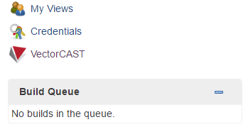
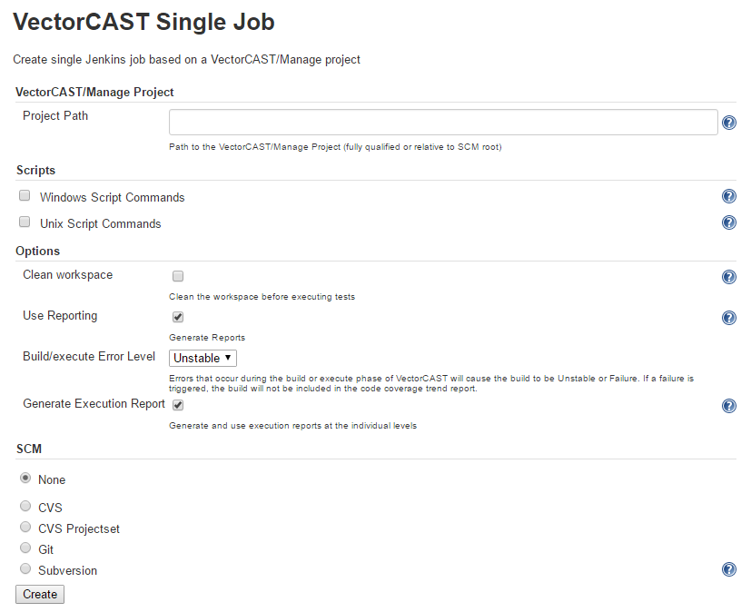

# Create, delete and update Jobs for [VectorCAST](http://www.vectorcast.com/)/Manage projects.

# Summary

This plugin allows the user to create, delete and update Jobs to build
and run
[VectorCAST](http://www.vectorcast.com/) projects.
Coverage is displayed using the [VectorCAST Coverage
Plugin](https://wiki.jenkins.io/display/JENKINS/VectorCAST+Coverage+Plugin).

Jobs can be created as a single job or split into multiple jobs for a
Manage project, with one job for each environment and an overall job to
combine the results.

# Usage

This plugin adds a new top-level menu item to the Jenkins sidebar.

that provides job control for
[VectorCAST](http://www.vectorcast.com/)/Manage projects

## Job Types

There are 2 types of jobs

-   **Single Job**
-   **Multi Job**

### Single Job

**Single** creates a single Jenkins job to build/execute and
(optionally) report on all environments in a VectorCAST/Manage project.

### Multi Job

**Multi** creates a top-level Jenkins job to combine the results from
individual Jenkins jobs created for each environment in the
VectorCAST/Manage project. The options for a multi-job are the same as
for single apart from supplying a copy of the Manage project.

Jenkins jobs normally build and run in independent workspaces. This is
the case with this integration. However, there are 2 options for running
tests

-   Use an SCM system (any that is supported by Jenkins)
    -   In this case, Jenkins will check out the code and tests into the
        workspace for each Jenkins job from your repository
    -   The top-level job will them combine the coverage and test
        results from all these individual machines/nodes
    -   In this case, the VectorCAST/Manage project should be specified
        as relative to the root of the checkout
    -   Each job can optionally clean up the working directory. If the
        working directory is not cleaned, then the results from the
        previous run allow VectorCAST/Manage to optimise the execution
        phase based on any code changes
-   Use a common, shared drive/directory
    -   In this case, the VectorCAST/Manage project should be specified
        as an absolute path that is available on all machines/nodes
    -   Note: Some network drives/shares do not fully implement file
        locking which cause SQLite, used by VectorCAST/Manage, problems
        that can result in corruption of the results. If this happens,
        you may need to use a different network drive/share or consider
        using an SCM system.
    -   Each job can optionally clean up the working directory which
        will have no effect on the VectorCAST/Manage project since it is
        located elsewhere
    -   The reports are generated into the workspace and archived as
        part of the Jenkins job

## Controlling Where Jobs Run

When using Multi Jobs, the jobs are created to run on specific nodes
related to the compiler chosen for the environment. E.g.

Make sure to set the labels on the relevant Jenkins nodes. Manage
Jenkins -\> Manage Nodes -\> configure appropriate node and set the
'Labels' field. In this example the labels have been set to
GNU\_Native\_5.1\_C and GNU\_Native\_4.8\_C

## Setup/Configuration

The requirements for using this plugin with VectorCAST are

-   VectorCAST needs to be installed and setup on each node to be used
    -   VECTORCAST\_DIR and VECTOR\_LICENSE needs to be set correctly
-   Jenkins needs to be installed and setup
    -   in particular BUILD\_URL needs to be defined (in
        Jenkins-\>Manage Jenkins-\>Configure System and define 'Jenkins
        URL' and save the settings

## Updating Existing Multi-job

An existing multi-job can be updated using the Update Multi-job setup
manually, or by creating an auto-update multi-job Job. The auto-update
job may require username/password to be supplied depending on your
Jenkins configuration.

## Known Issues

### Colours not showing in downloaded VectorCAST reports

See [Configuring Content Security
Policy](https://wiki.jenkins.io/display/JENKINS/Configuring+Content+Security+Policy)

"Jenkins 1.641 / Jenkins 1.625.3 introduce
the 'Content-Security-Policy' header to static files served by Jenkins
(specifically, 'DirectoryBrowserSupport'). This header is set to a very
restrictive default set of permissions to protect Jenkins users from
malicious HTML/JS files in workspaces, 'userContent', or archived
artifacts."

What this means is that the aggregate coverage report will show
everything as black rather than red/green/amber coverage colours.

The link above gives details of how to configure Jenkins to relax its
security.

### Junit publisher failing environment with no test cases

Junit publisher will fail any environments published with no test
results. If you have an environment with no test results, you will
manually need to check the box "Do not fail the build on empty test
results" in the Publish Junit test result report configuration.

### Changelog

See [CHANGELOG](CHANGELOG.md) 

