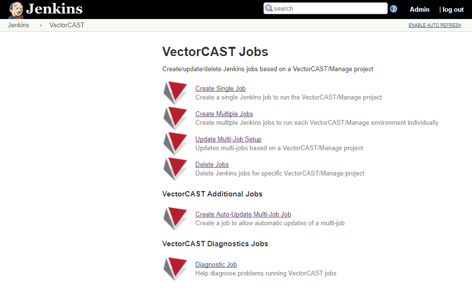
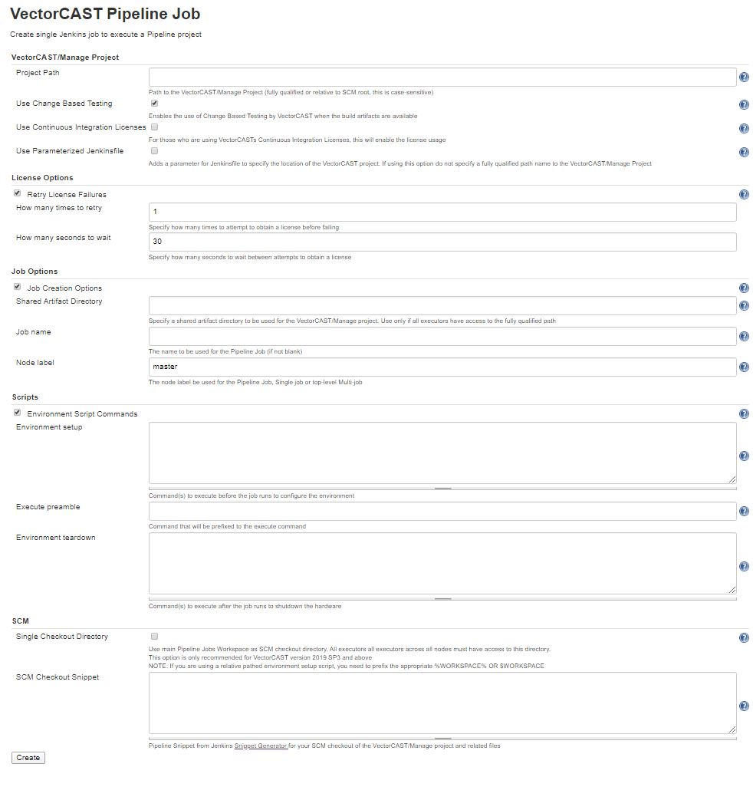
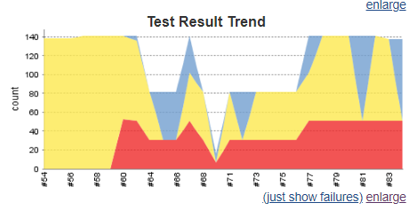
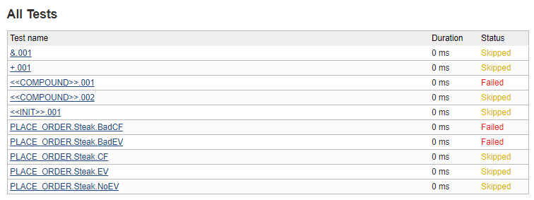
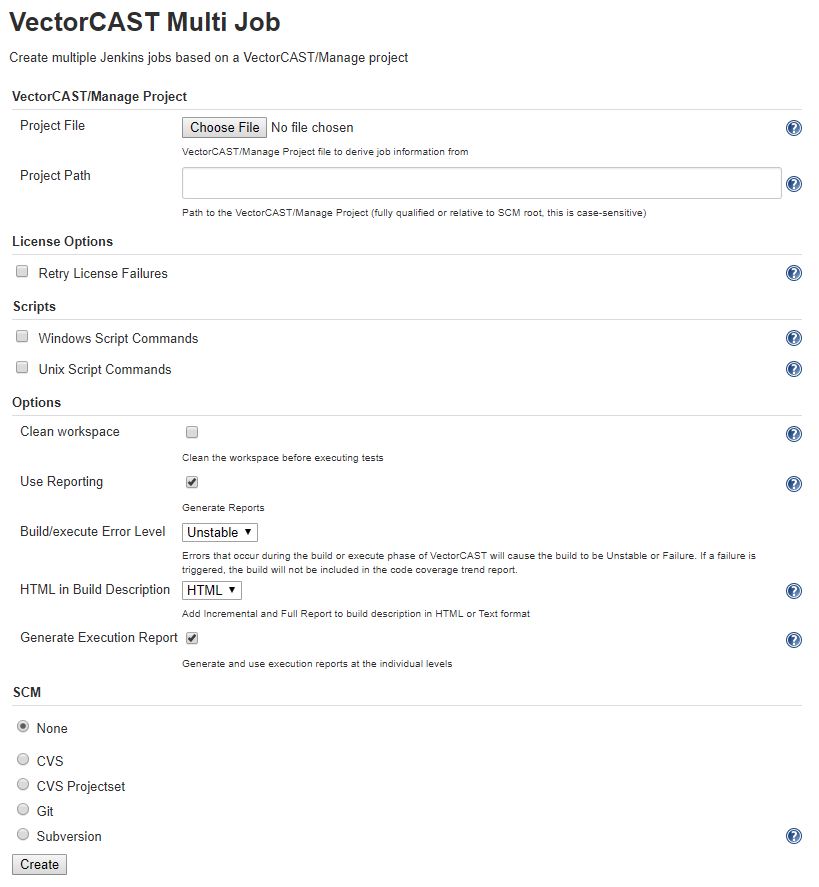

Create, delete and update Jobs for
[VectorCAST](http://vector.com/vectorcast)/Manage
projects.

# Summary

This plugin allows the user to create, delete and update Jobs to build
and run
[VectorCAST](http://vector.com/vectorcast) projects.
Coverage is displayed using the [VectorCAST Coverage
Plugin](https://wiki.jenkins.io/display/JENKINS/VectorCAST+Coverage+Plugin).

Jobs can be created as a single job or split into multiple jobs for a
Manage project, with one job for each environment and an overall job to
combine the results.

# Usage

This plugin adds a new top-level menu item to the Jenkins sidebar.


that provides job control for
[VectorCAST](http://vector.com/vectorcast)/Manage projects



## Job Types

There are 2 types of supported jobs and 1 deprecated job type

-   **Single Job**
-   **Pipeline Job**
-   **Multi-Job (Deprecated)**

### Single Job

**Single** creates a single Jenkins job to build/execute and
(optionally) report on all environments in a VectorCAST/Manage project.


### Pipepline Job

**Pipeline** creates a Jenkins Pipeline job to build/execute and
(optionally) report on all environments in a VectorCAST/Manage project
in parallel.

:warning:*Pipeline jobs require VectorCAST 2018 as a minimum version and VectorCAST 2019SP3 to perform parallel exeuction on a single VectorCAST Project*



There are 2 options for running tests
- Use an SCM system (any that is supported by Jenkins)
    -   In this case, Jenkins will check out the code and tests into the
        workspace for each Jenkins job from your repository
    -   The pipeline job will them combine the coverage and test
        results from all these individual machines/nodes
    -   In this case, the VectorCAST/Manage project should be specified
        as relative to the root of the checkout
    - There is now an option to use the main Pipeline Job's Workspace as 
        a dedicated single checkout directory.  This checkout directory must be available
        to all executors across all nodes either by having all executors running on the same
        computer or have the main Pipeline Job's Workspace on a shared network drive.
- Use an existing drive/directory for VectorCAST/Manage project
    -   In this case, the VectorCAST/Manage project should be specified
        as an absolute path that is available on all machines/nodes
    -   Each job can optionally clean up the working directory which
        will have no effect on the VectorCAST/Manage project since it is
        located elsewhere
    -   The reports are generated into the workspace and archived as
        part of the Jenkins job
 
The user will be able to disable the use of Change Based Testing to perform a 
complete run of their VectorCAST Project.  By default Change Based Testing is enabled, but 
this option can be disabled by unchecking the Use Change Based Testing box

For users with Continuous Integration Licneses, you will be able to access those licenses by
checking the Use Continuous Integration License checkbox.  If you do not have 
Continuous Integration License, do not check this box as you will encounter licensing errors.

If the user wishes to call the Jenkins job from another Pipeline job, check the box to 
parameterize the Jenkinsfile.  This will add parameters to the pipeline job  
that will be used by the VectorCAST pipeline job to locate the VectorCAST/Manage project (VCAST_PROJECT_DIR)
and for forcing the VectorCAST Jobs to be executed on a specific node (VCAST_FORCE_NODE_EXEC_NAME) instead of using 
the compiler as a node label.

Calling the build command will return Failed, Unstable, Success cooresponding to the results of the VectorCAST
Pipeline job.  To enabled the main pipeline job to continue, the user can surround the build command without
a _catchError_ block as demonstrated below

```
catchError(buildResult: 'SUCCESS', stageResult: 'FAILURE', catchInterruptions : false ) {
   build job: 'UnitTestingProject_vcast_pipeline', parameters: [string(name: 'VCAST_PROJECT_DIR', value: 'C:\\UnitTesting\\Project'), string(name: 'VCAST_FORCE_NODE_EXEC_NAME', value: 'MyTestNode')]
}
```

Additionally, if a shared artifact directory is specified, VectorCAST/Manage
will execute jobs independently, but have a central location for storing
the build artifacts.  This option can be used to accelerate testing by use
of VectorCAST's Change Based Testing feature. 

For Pipeline jobs, the plugin processes the build log to determine which
tests have been skipped by VectorCAST's Change Based Testing feature.  Any
test cases that had previously pass and were skipped on the current execution
will be marked as skipped for JUnit and display as such in yellow on the test result
trend chart:



and denoted as _Skipped_ in the test results list



        
### Multi-Job (Deprecated)

**Multi-Job (Deprecated)** creates a top-level Jenkins job to combine the results from
individual Jenkins jobs created for each environment in the
VectorCAST/Manage project. The options for a multi-job are the same as
single apart from supplying a copy of the Manage project.



Jenkins jobs normally build and run in independent workspaces. This is
the case with this integration. However, there are 2 options for running
tests

-   Use an SCM system (any that is supported by Jenkins)
    -   In this case, Jenkins will check out the code and tests into the
        workspace for each Jenkins job from your repository
    -   The top-level job will them combine the coverage and test
        results from all these individual machines/nodes
    -   In this case, the VectorCAST/Manage project should be specified
        as relative to the root of the checkout
    -   Each job can optionally clean up the working directory. If the
        working directory is not cleaned, then the results from the
        previous run allow VectorCAST/Manage to optimize the execution
        phase based on any code changes
-   Use a common, shared drive/directory
    -   In this case, the VectorCAST/Manage project should be specified
        as an absolute path that is available on all machines/nodes
    -   Note: Some network drives/shares do not fully implement file
        locking which cause SQLite, used by VectorCAST/Manage, problems
        that can result in corruption of the results. If this happens,
        you may need to use a different network drive/share or consider
        using an SCM system. Using VectorCAST vc2019 SP3 eliminates these 
        errors
    -   Each job can optionally clean up the working directory which
        will have no effect on the VectorCAST/Manage project since it is
        located elsewhere
    -   The reports are generated into the workspace and archived as
        part of the Jenkins job

## Controlling Where Jobs Run

When using Multi-Jobs, the jobs are created to run on specific nodes
related to the compiler chosen for the environment. E.g.


Make sure to set the labels on the relevant Jenkins nodes. Manage
Jenkins -\> Manage Nodes -\> configure appropriate node and set the
‘Labels’ field. In this example the labels have been set to
GNU\_Native\_5.1\_C and GNU\_Native\_4.8\_C


## Setup/Configuration

The requirements for using this plugin with VectorCAST are

-   VectorCAST needs to be installed and setup on each node to be used
    -   VECTORCAST\_DIR and VECTOR\_LICENSE needs to be set correctly
-   Jenkins needs to be installed and setup
    -   in particular BUILD\_URL needs to be defined (in
        Jenkins-\>Manage Jenkins-\>Configure System and define 'Jenkins
        URL' and save the settings

## Updating Existing Multi-job (Deprecated)

An existing multi-job can be updated using the Update Multi-job setup
manually, or by creating an auto-update multi-job Job. The auto-update
job may require username/password to be supplied depending on your
Jenkins configuration.

## Known Issues

### Colors not showing in downloaded VectorCAST reports

See [Configuring Content Security
Policy](https://wiki.jenkins.io/display/JENKINS/Configuring+Content+Security+Policy)

"Jenkins 1.641 / Jenkins 1.625.3 introduce
the `Content-Security-Policy` header to static files served by Jenkins
(specifically, `DirectoryBrowserSupport`). This header is set to a very
restrictive default set of permissions to protect Jenkins users from
malicious HTML/JS files in workspaces, `/userContent`, or archived
artifacts."

What this means is that the aggregate coverage report will show
everything as black rather than red/green/amber coverage colors.

The link above gives details of how to configure Jenkins to relax its
security.

### JUnit publisher failing environment with no test cases

For non-pipeline jobs, JUnit publisher will fail any environments published 
with no test results. If you have an environment with no test results, 
you will manually need to check the box "Do not fail the build on empty test
results" in the Publish JUnit test result report configuration.

## Change Log

### Version 0.65 (17 Dec 2020)
- Single jobs not displaying full report and rebuild report correctly in summary (VC2020)
- Capturing stdout for skipped analysis causing console output to be delayed
- Pipeline job fails unless user specific .vcm for manage project
- Problem with CBT analysis when not using single checkout directory
- Using lowercase %workspace% causes single checkout directory error
- Updated managewait.py to overcome race condition causing script to hang on readline()
- Added skipped test analysis to Single Jobs
- Added detection of disabled environment to DataAPI generated results

### Version 0.64 (17 Nov 2020)
- Skipped tests not detected for cover environments 
- Check for illegal characters in pipeline job names 
- Add Option to not use CBT in Jenkins pipeline plugin 
- VC2020 Manage reports have no formatting in Jenkins job summary 
- Remove xUnit reporting 
- Remove truncated output during the build 
- "Could not acquire a read lock on the project's vcm file" should raise an error, but it does not 
- Add option to active CI licenses 
- Regression Scripts with identical ending directories show testcase as skipped 
- Add option to make job parameterized for Manage project location and Force Node Execution rather than compiler 
- Update error thrown when user creates absolute path with SCM snippet 
- Need to add more error detection 
- Expand JUnit test case name display to include file.subprogram 
- Change reports to not use VCAST_RPTS_SELF_CONTAINED=FALSE 

### Version 0.63 (30 April 2020)

- Support Multi-Branch Pipelines
- Include plugin version in Pipeline Job Jenkins Script and console log
- Check for illegal characters in Pipeline Job names
- Update Single and Multi-Jobs to use same reporting as Pipeline Jobs
- Remove CombinedReport.html from previous Pipeline job build at beginning of new build
- Make aggregate coverage results consistent with VectorCAST/Manage aggregate coverage results
- Always use new VectorCAST report API for VectorCAST/2019 and later
- Fix potential file access race condition when generating xml
- Fix exception when building VectorCAST/Unit regression script environments
- Support for VectorCAST/vpython 3

### Version 0.62 (10 March 2020)

- Introduce pipeline job

### Version 0.61 (21 Dec 2019)

- Updated support for Jenkins Pipeline 
- Updated python scripts to work with VectorCAST 2019 SP3
- Added fix for Ada environments not building properly

### Version 0.60 (2 Oct 2019)

- Update support for Manage API and VCAST_RPTS_SELF_CONTAINED

### Version 0.59 (13 Sept 2019)

-   Update for VECTORCAST\_DIR rollback

### Version 0.58 (11 Sept 2019)

-   Update for different drive than workspace

### Version 0.57 (6 Sept 2019)

-   Updates for duplicate results in multijob

### Version 0.56 (5 Sept 2019)

-   Revert changes from 0.43 and 0.44 to remove need for
    VECTORCAST\_DIR. VECTORCAST\_DIR will need to be defined when
    running Jenkins for now.

### Version 0.55 (4 Sept 2019)

-   Add support for new VCAST\_RPTS\_SELF\_CONTAINED option added in
    VC19 SP2
-   Add support for using Manage API to generate XML reports if
    available
-   Correct variable expression on Linux platforms
-   Updated scripts to handle compound only in compound case

### Version 0.54 (28 Aug 2019)

-   Updates for F+FC coverage and updating database pathing

### Version 0.53 (20 Aug 2019)

-   Updates for changed to aggregate coverage report metrics heading
    change

### Version 0.52 (13 Aug 2019)

-   Additional debug logging

### Version 0.51 (8 Aug 2019)

-   Updates for scripts not handling Ada operator "+"

### Version 0.50 (11 Jul 2019)

-   Update exception handling when using DataAPI

### Version 0.49 (1 Jul 2019)

-   Updated to support VectorCAST 2019 SP1

### Version 0.48 (26 Jun 2019)

-   Update to get complete display name for C++ functions
-   Update to fix characters that need escaping in XML attributes

### Version 0.47 (18 Jun 2019)

-   Fix for disabled environments
-   Fix for printing non UTF-8 compliant failure code

### Version 0.46 (30 May 2019)

-   Updates for using external CSS/images

### Version 0.45 (10 May 2019)

-   Removed xUnit dependency and converted to JUnit.

### Version 0.44 (1 May 2019)

-   Added better legacy support for VectorCAST installations that do not
    have their executables on the system PATH

### Version 0.43 (26 Apr 2019)

-   Removed all uses of the environment variable VECTORCAST\_DIR. From
    now on it is assumed that VectorCAST executables are on the system
    PATH. Legacy support is still maintained for older versions of
    VectorCAST.
-   Additional cleaning up of old files

### Version 0.42 (25 Apr 2019)

-   Updates for corner cases, verbose out issue, and cleaning up
    previous build's files
-   Problem when function coverage enabled, but not function call
-   Function coverage format incorrect in XML causing plugin to throw an
    error
-   Added catch for additional licensing errors
-   Added catch for all (E) Line: errors in the console log

### Version 0.41 (12 Apr 2019)

-   Fix for function and basis path coverage when using VectorCAST 2019

### Version 0.40 (10 Apr 2019)

-   Update to fix auto job updates (where path to Manage project was
    being removed)

### Version 0.39 (19 Mar 2019)

-   Update to make the management report generate for a cover project

### Version 0.38 (23 Jan 2019)

-   Fix for spurious newline characters in report title in XML for
    Jenkins with VectorCAST 2019

### Version 0.37 (10 Jan 2019)

-   Corrected missing " that may affect running multi-job on Linux
-   Added support for generating reports using VectorCAST 2019

### Version 0.36 (27 Sept 2018)

-   Support overlapping version 17 Manage projects
-   Updates to support long directory paths in VectorCAST/Manage
    reporting

### Version 0.35 (15 May 2018)

-   Support newer versions of xUnit plugin

### Version 0.34 (10 May 2018)

-   Support MultiJob plugin up to 0.29 and later, 0.30 onwards

### Version 0.33 (18 Jan 2018)

-   Don't create intermediate CSV file for bad test case management
    report

-   Raise post-groovy alert for bad test case management report

### Version 0.32 (15 Jan 2018)

-   Improve support for unit without coverage, avoiding corrupt xml
    files

### Version 0.31 (13 Dec 2017)

-   Removed spurious " in Linux single job
-   Corrected link from xUnit graph to report

### Version 0.30 (5 Dec 2017)

-   Correct regression with report naming for archived artifacts with
    shorter names
-   Added environment variable (VCAST\_VC\_SCRIPTS) to provide optional
    source of vc\_scripts

### Version 0.29 (27 Nov 2017)

-   Improve support for long Manage project names, environment names and
    compiler names

### Version 0.28 (2 Nov 2017)

-   Correct regression with windows variable names being used in Unix
    script

### Version 0.27 (2 Nov 2017)

-   Correct regression with missing space in commands for single job

### Version 0.26 (1 Nov 2017

-   Option to set the name of the single job or multi-job (name is
    pre-pended to sub-job in the case of multi-jobs)
-   Option to configure (at creation/update time) the node to run the
    single job or top-level multi-job on
-   Allow license retries for single jobs
-   Update summary/detailed text written by the groovy scripts

### Version 0.25 (26 Oct 2017)

-   Update to retry functionality to support jobs created with earlier
    plugin versions

### Version 0.24 (25 Oct 2017)

-   Update to store and use job details when auto-updating
-   Added (optional) ability to retry a command if it fails due to
    unavailable license

### Version 0.23 (17 Oct 2017)

-   Added a job that can be used to update an existing multi-job

### Version 0.22 (26 Sept 2017

-   Added support for new version of VectorCAST Manage that uses 2
    levels instead of 4

### Version 0.21 (24 Jul 2017)

-   Improved groovy script to mark failing builds as failed rather than
    unstable

### Version 0.20 (18 Jul 2017)

-   Allow conversion script to accept report that has a missing or
    incomplete Function Coverage column

### Version 0.19 (23 Jun 2017)

-   Added --force option to use of --release-locks
-   Added option to use either HTML or TEXT format for the build
    description

### Version 0.18 (20 Mar 2017)

-   Add execution report link to all test cases
-   Added update to pulling in both the full report and incremental
    build report into the job build description
-   Added update to pulling in both the full report and incremental
    build report into the job build description

### Version 0.17 (17 Mar 2017)

-   Always display the VectorCAST menu and leave permission
    checking/reporting to Jenkins

### Version 0.16 (15 Mar 2017)

-   Corrected processing checking if BUILD\_URL has been set

### Version 0.15 (2 Jan 2017)

-   Corrected processing to support function and function call coverage

### Version 0.14 (16 Dec 2016)

-   Corrected typos in Diagnostics job and pattern for files to copy

### Version 0.13 (14 Dec 2016)

-   Add support for spaces in paths

### Version 0.12 (9 Dec 2016)

-   Add support to keep or clean the working directory

### Version 0.11 (7 Dec 2016)

-   Support added for multi-job with SCM and for calculating correctly
    aggregated coverage for the top-level display in the VectorCAST
    coverage plugin

### Version 0.10 (23 Nov 2016)

-   Initial release (no support for using SCM with multi-job)
